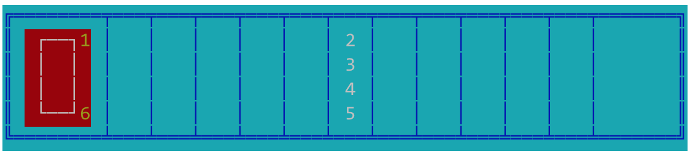
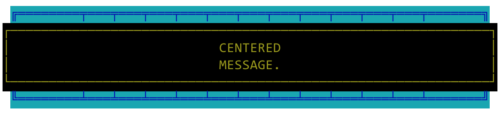

Programming Styles -- SoSe20
---

# Additional Requirements for Assignment 3
This document reports the additional requirements for Assignment 3. If you believe that the document lacks details, please use open issues and create pull requests.

## Before Starting

Before starting to implement the solution please make the following considerations:

- You are going to use different styles in the same program, they should not conflict, but if they do: either re-design your solution to make the conflict disappear, or be ready to clearly explain why you violate one or the other style's constraint.

- You are going to use different styles in the same program but you do not have necessary to mix them, do it so **only** if that's necessary/beneficial for you. For example, while implementing the program using **Hollywood and Plugins**, you must implement the "main" program according to **Hollywood** (so use callbacks), but there's no need to implement the whole plugins according to that style. Just make sure that when the plugins and the program meet you do not violate any of the styles. As always, document your choices and ask for feedback

- Do not take short-cuts. You know that we are using aspects and plugins, so to some extend you can design your program in a way it is easier to be extended by the aspects and plugins. But do not make your programs dependent on them! In other words, your programs should not be coded with special codes for or direct access to the aspects and plugins implementation. It's the other way around. For example, in the aspects you know where join point to instrument/wrap.

- Do not use external libraries. You might be temped to use external libraries for implementing the bulletin board, the aspects, etc. DO NOT DO IT! On one side, including another library limits your ability to apply aspects and plugins; on the other side, learning how to use another library is not what we want to do here and using such library might be overkilling.

- Keep it simple. To implement simple Aspects in java my suggestion is to try to use proxies. The aspects are quite simple and do not require the full power of Aspect Oriented Programming.

- Use what you have been given. The coloring schema and the class to collect stats are given to you. Use them, do not modify them. This simplifies your development, and the testing of your solution.


## Coloring Output
For the task **Bulletin Board and Aspects**, one of the aspect is in charge of changing the color of the UI.

To color textual output you need to include "special" characters that activate the various colors (both for foreground and background). The special characters that you need to use are already listed inside: `ColorPaletter.java`. 

For example, you can take the following text: 

[This is a text]

A change it to: 


by adding the following special characters in front of it `\u001B[40m``\u001B[37m`

`\u001B[37m` makes the font white (FOREGROUND color is white)

`\u001B[40m` makes the background black (BACKGROUND color is black)

The coloring machinery has a state: you activate a color with a special character and, unless you change it to another color or reset to default, that color remains active. This means that all the text that you print *after* a special characters will be rendered has specified by that character. 

Foreground and background colors do not replace one another but they sum up, while the reset code `\u001B[0m` disable all the colors.

So the following sequence, which is not terminated by reset, `\u001B[41m``AAA``\u001B[40m``\u001B[37m``BBB` produces as output:

[withoutreset](colored-message-without-reseting.png "")

While the following sequence, which includes the reset control character, `\u001B[41m``AAA``\u001B[40m``\u001B[37m``BBB``\u001B[0m` produces as output:

[withreset](colored-message-with-reseting.png "")

For the assignment you need to color the boat with a red background and a white foreground, the board and its tiles with a cyan background and a blue foreground and the message banners with a black background and a yellow foreground. The fishes and fishermen instead are white and yellow respectively.

The image below shows the status of the initial board when coloring is active:


> **Note**: Please look carefully at the boat: The red background starts one position before the box and both fishermen are on the boat, so their background color must be the one of the boat.

The image below shows the status of the board with a generic overlay message banner over the starting board.




## The FIXED (width) Text-UI

For the task **Hollywood and Plugins**, one of the rendering plugin must create boards that always have the same length. In this case, when the boat moves down the river, you do not have to remove tiles from the game board.

The following example should clarify the requirements.
Imagine that you receive the following inputs: 
`[1, 6, 2, 4, 4, 4, 4 ,4, 4, 6, 6, 6, 6, 6, 6, 6, 6, 6]`

At the beginning the board is same as always:

```
╔════════╤═══╤═══╤═══╤═══╤═══╤═══╤═══╤═══╤═══╤═══╤═══╤═══════╗[\n]
║  ┌──┐1 │   │   │   │   │   │ 2 │   │   │   │   │   │       ║[\n]
║  │  │  │   │   │   │   │   │ 3 │   │   │   │   │   │       ║[\n]
║  │  │  │   │   │   │   │   │ 4 │   │   │   │   │   │       ║[\n]
║  └──┘6 │   │   │   │   │   │ 5 │   │   │   │   │   │       ║[\n]
╚════════╧═══╧═══╧═══╧═══╧═══╧═══╧═══╧═══╧═══╧═══╧═══╧═══════╝[\n]
```

After reading `[1, 6]` the status of the board is the following:

```
╔═══╤═══╤════════╤═══╤═══╤═══╤═══╤═══╤═══╤═══╤═══╤═══╤═══════╗[\n]
║   │   │  ┌──┐1 │   │   │   │ 2 │   │   │   │   │   │       ║[\n]
║   │   │  │  │  │   │   │   │ 3 │   │   │   │   │   │       ║[\n]
║   │   │  │  │  │   │   │   │ 4 │   │   │   │   │   │       ║[\n]
║   │   │  └──┘6 │   │   │   │ 5 │   │   │   │   │   │       ║[\n]
╚═══╧═══╧════════╧═══╧═══╧═══╧═══╧═══╧═══╧═══╧═══╧═══╧═══════╝[\n]
```

As you see the boat moved two tiles closed to the fishes.

After reading `2, 2, 2, 2, 2, 4, 4, 4, 4 ,4, 4, ` the fishes move. 
Fish 2 is almost safe, while Fish 4 is safe:

```
╔═══╤═══╤════════╤═══╤═══╤═══╤═══╤═══╤═══╤═══╤═══╤═══╤═══════╗[\n]
║   │   │  ┌──┐1 │   │   │   │ ▓ │   │   │   │   │ 2 │       ║[\n]
║   │   │  │  │  │   │   │   │ 3 │   │   │   │   │   │       ║[\n]
║   │   │  │  │  │   │   │   │ ▓ │   │   │   │   │   │   4   ║[\n]
║   │   │  └──┘6 │   │   │   │ 5 │   │   │   │   │   │       ║[\n]
╚═══╧═══╧════════╧═══╧═══╧═══╧═══╧═══╧═══╧═══╧═══╧═══╧═══════╝[\n]
```

After reading the remaining inputs are processed (they all are `6`) the boat reaches the end of the board. And the game is over. The message says Fishermen won.

```
 ╔═══╤═══╤═══╤═══╤═══╤═══╤═══╤═══╤═══╤═══╤═══╤════════╤═══════╗ [\n]
┌──────────────────────────────────────────────────────────────┐[\n]
│                  The fishing was good; it's                  │[\n]
│                  the catching that was bad.                  │[\n]
└──────────────────────────────────────────────────────────────┘[\n]
 ╚═══╧═══╧═══╧═══╧═══╧═══╧═══╧═══╧═══╧═══╧═══╧════════╧═══════╝ [\n]
```

> Note: The same requirements to display the message centered still applies, including the white spaces before and after the board.

## Plugins Exceptional Cases

For the plugins style we assume that the plugin configuration file (`config.ini`) exists and always specify a valid plugin name (`default` or `fixed`). If your program cannot find a valid configuration file or the configuration specified therein are not valid (e.g., the file is empty; the file points toward a plugin that does not exist; etc.) the execution should stop with an Error!

> In other words, do not enforce any hardcode behavior in the program, like using "default" if nothing else works

## References

* Generating colored output on Console. [https://stackoverflow.com/questions/5762491/how-to-print-color-in-console-using-system-out-println](https://stackoverflow.com/questions/5762491/how-to-print-color-in-console-using-system-out-println)

* Implementing aspects without AspectJ (or other libraries). [https://stackoverflow.com/questions/23327115/aspect-oriented-programming-in-java-without-aspectj](https://stackoverflow.com/questions/23327115/aspect-oriented-programming-in-java-without-aspectj)

* Using Dynamic Proxies as a mechanism to use the Aspects Style in Java:
    * [http://tutorials.jenkov.com/java-reflection/dynamic-proxies.html](http://tutorials.jenkov.com/java-reflection/dynamic-proxies.html)
    * [https://www.baeldung.com/java-dynamic-proxies](https://www.baeldung.com/java-dynamic-proxies)
    * [https://opencredo.com/blogs/dynamic-proxies-java/](https://opencredo.com/blogs/dynamic-proxies-java/)
    * [https://opencredo.com/blogs/dynamic-proxies-java-part-2/](https://opencredo.com/blogs/dynamic-proxies-java-part-2/)

* Using INI files with Node/Javascript: [https://thisdavej.com/using-ini-files-in-your-node-js-applications-for-health-and-profit/](https://thisdavej.com/using-ini-files-in-your-node-js-applications-for-health-and-profit/)
